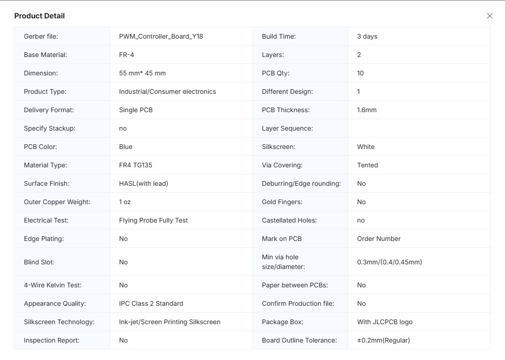
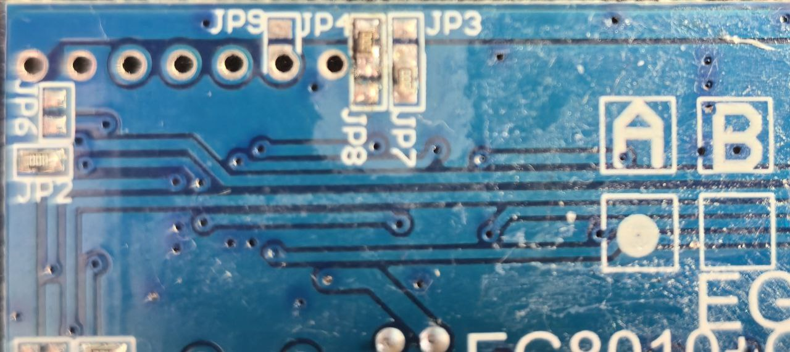
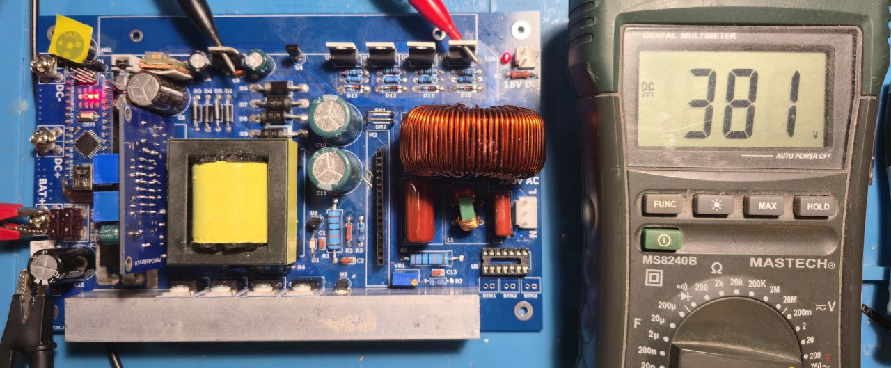
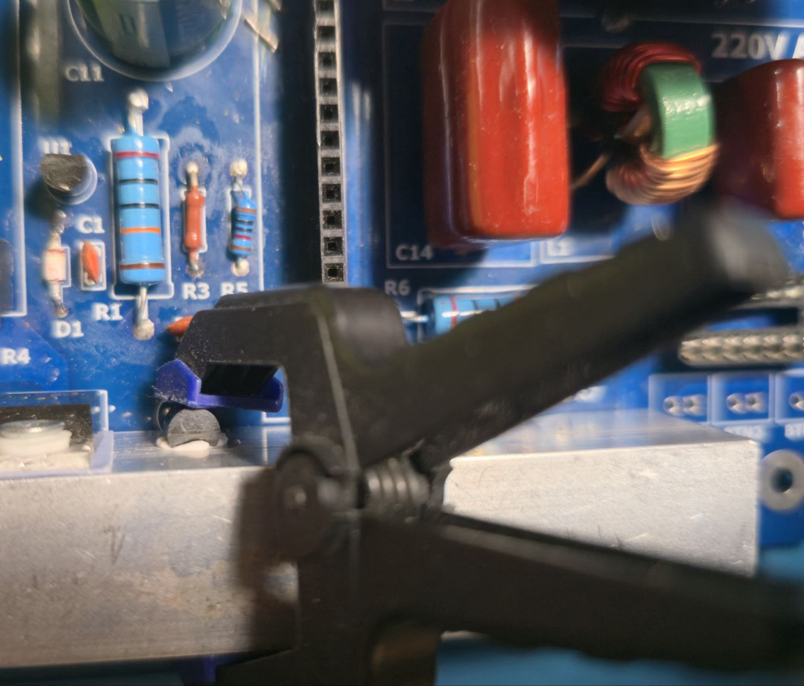

# Pure-Sinus

The purpose of this project is to provide a universal solutions for portable power stations, battery chargers and inverters. 

# Solr Mobile Power Management Platform


A Small, but powerful battery powered control electronics with output power up to 500W. 
Also, it can be used as a standalone pure sine wave inverter from 12V DC to 220V AC.
The system includes intelligent monitoring, protection, and management features for safe, reliable portable power delivery.

### Key Features

- **Pure Sine Wave AC Output**: 220V 50Hz AC up to 500W
- **500W Power Rating**: Sufficient for charging multiple devices and powering small appliances
- **DC Output**: 12V DC with up to 180W output for USB charging and DC loads
- **Lithium 3S 12V Battery Input**
- **Intelligent Power Management System**:
  - **Real-time battery voltage monitoring**: Low-battery protection with hysteresis
  - **Overload & Short-Circuit Protection**
  - **Dual Current Sensing**: Independent monitoring of DC output and AC inverter currents
  - **Dual Temperature Monitoring**: With automatic fan control and overheat protection
  - **Bidirectional DC**: DC output can also be used to charge the battery
  - **Low power consumption in standby mode**
- **Portable & Modular**: Designed as a platform for expanding functionality

### Use Cases

✓ **Device Charging**: Portable charging station for phones, tablets, and laptops  
✓ **Power Tools**: Supply stable AC power to cordless tools and equipment  
✓ **Emergency Power**: Backup power for critical devices during outages  
✓ **Outdoor Adventures**: Portable power for camping, RVs, and off-grid scenarios  
✓ **IoT & Smart Devices**: Reliable power for home automation and smart systems  

### Project Structure

```
pure-sinus/
├── hardware/                      # Altium PCB designs and circuit schematics
│   ├── inverter_12V_220V_500W/    # Main inverter/power station board
│   │   ├── Fabrication Files/     # Gerber, BOM, and manufacturing files
│   │   └── libs/                  # Component libraries for Altium Designer
│   └── tl494_pwm_controller/      # Dedicated PWM controller module
├── software/                      # PlatformIO firmware and control logic
│   └── inverter-controller/       # Arduino firmware (PlatformIO-based)
│       ├── src/main.cpp           # Main controller state machine
│       ├── include/               # Header files and configuration
│       ├── lib/                   # Custom and external libraries
│       └── platformio.ini         # PlatformIO project configuration
```

### Hardware Specifications

### Main Components

- **Microcontroller**: Arduino Nano (ATmega328P)
- **PWM Controller**: TL494 PWM IC (with custom dedicated module)
- **Pure Sinus Driver**: EGS002
- **Current Sensors**: 
  - ACS712 30A Hall-effect current sensor DC
  - ACS758 100A Hall-effect current sensor AC
- **Temperature Sensors**: LM35
- **Output Transformer**: EC42-20 High-frequency SMPS transformer (12V→380V conversion)

### Hardware Assembly

### 1. TL494 PWM Module Assembly And Setup

- `pwm_controller_board.rar` contains all required files for PCB manufacturing the TL494 PWM module and located in `/tl494_pwm_controller/Fabrication Files`
- 
- Follow the provided BOM and Gerber files to fabricate and assemble the PWM module
- 
- PWM module setup: 
    - Connect 12V power supply to `+12V` and `GND`
    - Set the frequency to `32kHz` for outputs `OutA` and `OutB` using potentiometer `Freq`
    - Adjust potentiometer `Duty` for `42%` duty cycle at no load
    - No need to configure current limiter, so `I-Sense` pin can be connected directly to ground
- 

### 2. EGS002 Driver Module Setup

The EGS002 module handles pure sinus wave generation
- 
- Solder `JP8` jumper to `JP4`, to set dead time for `1.0us`
- 
- 
- No additional configuration is required

### 3. Inverter Board Assembly And Setup

- `inverter_board.rar` contains all required files for PCB manufacturing the board and located in `/inverter_12V_220V_500W/Fabrication Files/`
- 
- Follow the provided BOM and Gerber files to fabricate and assemble the PCB
- 

### Assembly Steps

1. First, solder all SMD components on top and bottom layers
2. Solder all components, except `C6, C10, C11, T1, C21, M1 and M2`
3. Place heat sink `HS1` and `HS2`, then solder MOSFETs and LM78xx, secure with screws and isolating pads
4. Solder all other components except driver modules and Arduino
5. ***Note:*** It is recommended to use sockets for the microcontroller and driver modules for easy replacement and troubleshooting.
6. Then, connect/solder the `Arduino` and `TL494 PWM module`
7. Program the Arduino with the provided firmware
8. Connect laboratory power supply to `12V` input, set the current limit to `4-5A`, set `J8` switch and power on the board
9. Measure HV output voltage, it should be `400V DC` with no load and no `EGS002` module connected
- 
10. Turn off power supply and wait(`R2` also used as bleed resistor) or discharge HV capacitors `C10` and `C11` before connecting the `EGS002` module
11. Connect the `EGS002`, run the next time. `EGS002` led should be on continuously indicating normal operation
12. Measure the output `AC` voltage, adjust the `VR1` potentiometer to set output voltage to `230V AC`
13. Check output `AC` waveform with oscilloscope, it should be a clean sine wave, also check with a load connected
- 
14. Check output `DC` voltage, it should be `12V DC`
15. Connect cooling fan: it should run for a short time on power on, during system self-check
16. Then, set debug switch `P1` to on. Check ACS current sensors outputs, adjust if needed
17. Finally, glue thermal sensors to heat sinks using thermal adhesive glue (`heatsinkplaster`)
- 

### Parts List
- Heat Sinks **HS1 and HS2** `150x19.7x15.6mm`: [link Aliexpress](https://www.aliexpress.com/item/1005004124759503.html?spm=a2g0o.productlist.main.1.42223a20SAT5k2&algo_pvid=6427d303-d8d6-43af-a767-dd0f720f51ae&algo_exp_id=6427d303-d8d6-43af-a767-dd0f720f51ae-0&pdp_ext_f=%7B%22order%22%3A%22378%22%2C%22spu_best_type%22%3A%22order%22%2C%22eval%22%3A%221%22%2C%22fromPage%22%3A%22search%22%7D&pdp_npi=6%40dis%21EUR%212.55%212.55%21%21%2120.51%2120.51%21%40211b628117670993457081121e6103%2112000030402237637%21sea%21LV%21143434442%21X%211%210%21n_tag%3A-29919%3Bd%3A4c3c036e%3Bm03_new_user%3A-29895&curPageLogUid=1Bff7gj6ESD6&utparam-url=scene%3Asearch%7Cquery_from%3A%7Cx_object_id%3A1005004124759503%7C_p_origin_prod%3A)
- Transformer **T1** `12V To 0-220V-380V 18V 500W EC42`: [link Aliexpress](https://www.aliexpress.com/item/1005003166892846.html?spm=a2g0o.order_list.order_list_main.5.2afd1802XkXKQq)
- Inductor **L2** `1.5 V. 2mH`: [link Aliexpress](https://www.aliexpress.com/item/1005006733553679.html?spm=a2g0o.order_list.order_list_main.382.6bd81802CETRoA)
- Choke filter **L1** `5A`: [link Aliexpress](https://www.aliexpress.com/item/33005799242.html?spm=a2g0o.order_list.order_list_main.65.6bd81802CETRoA)
- Capacitors **C10 and C11** `100uF 450V`: [link Aliexpress](https://www.aliexpress.com/item/1005006810057095.html?spm=a2g0o.order_list.order_list_main.362.6bd81802CETRoA)
- Shunt Resistor **SH1 and SH2** `20mR 1x10`: [link Aliexpress](https://www.aliexpress.com/item/1005005512229757.html?spm=a2g0o.order_list.order_list_main.372.6bd81802CETRoA)
- Screw terminal connectors **J3, J4, J5, J6**: [link Aliexpress](https://www.aliexpress.com/item/1005007060857910.html?spm=a2g0o.order_list.order_list_main.377.6bd81802CETRoA)
- Fuses **F1, F2** `25A`: [link Aliexpress](https://www.aliexpress.com/item/1005003956737422.html?spm=a2g0o.order_list.order_list_main.347.6bd81802CETRoA)
- The complete Bill of Materials (BOM) can be found in the `/inverter_12V_220V_500W/Fabrication Files/` directory as `BOM_Inverter_12V_220V_500W.xlsx`.

### Firmware Architecture

Built with **PlatformIO** and **Arduino Framework** targeting Arduino Nano `ATmega328P`.

**Debug**:
- **When debug switch set**: 9600 baud UART can be used for monitoring and troubleshooting

## Safety Considerations And Warnings

### ⚠️ High Voltage Warning

This project operates with dangerous voltages

## Next Version Improvements

- [ ] **OLED display and controls**: Add an OLED display and control buttons for monitoring and outputs on/off control
- [ ] **Multi-Output USB**: Integrate USB-C and USB-A charging ports with PD protocol support, with up to 100W
- [ ] **Battery Chemistry Flexibility**: Support for LiFePO4, Lead-acid, and other battery types
- [ ] **Solar Input**: Add MPPT/PWM solar charge controller for renewable energy integration
